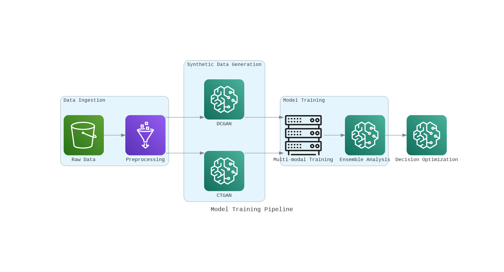
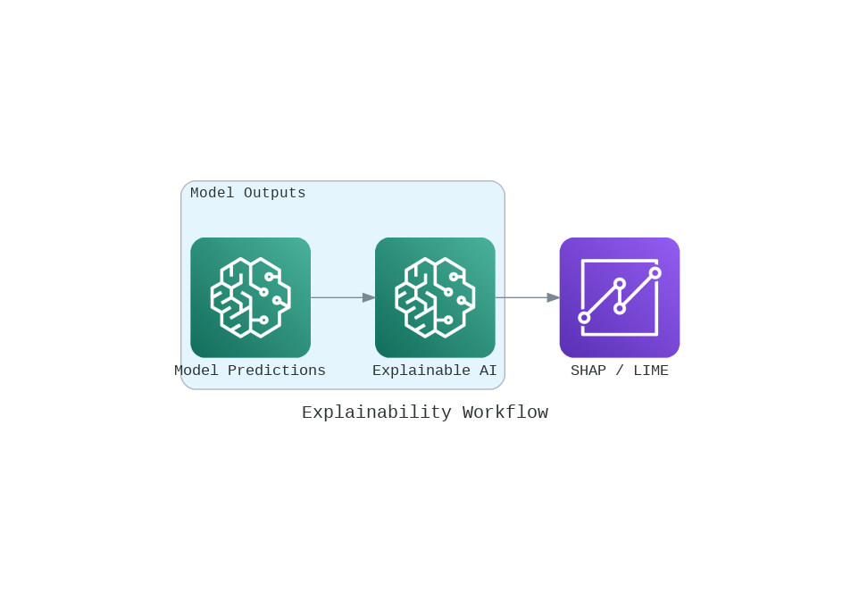
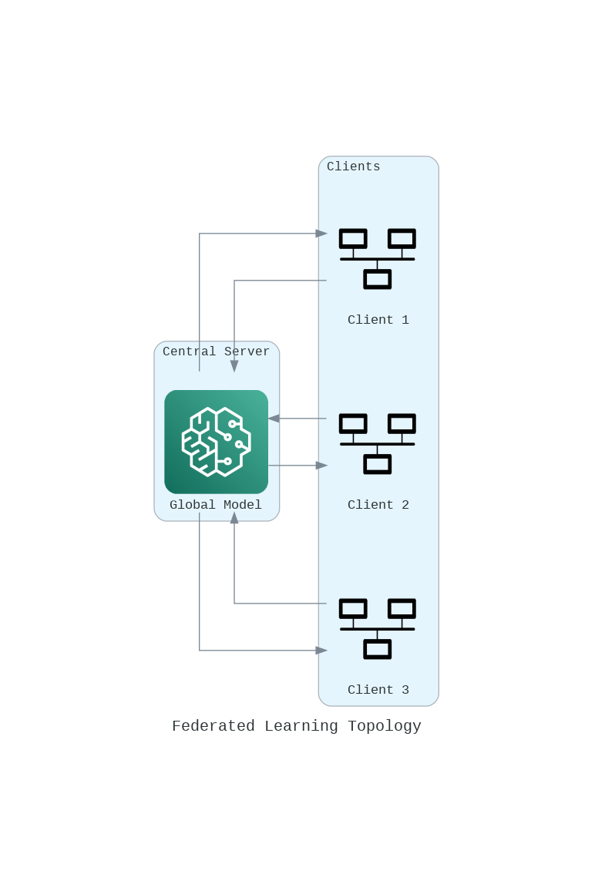
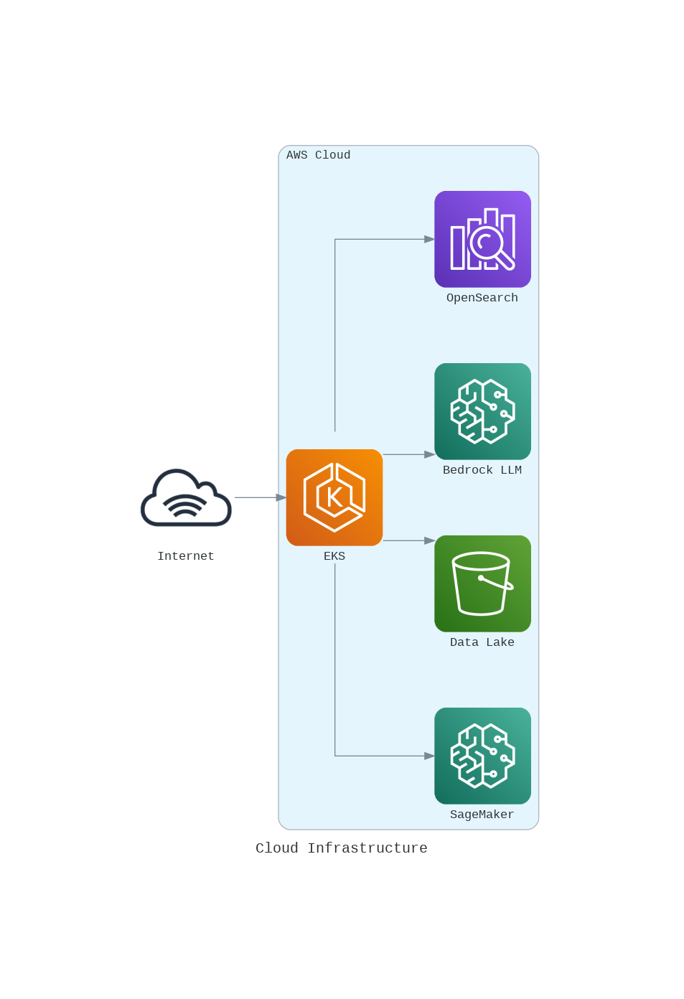
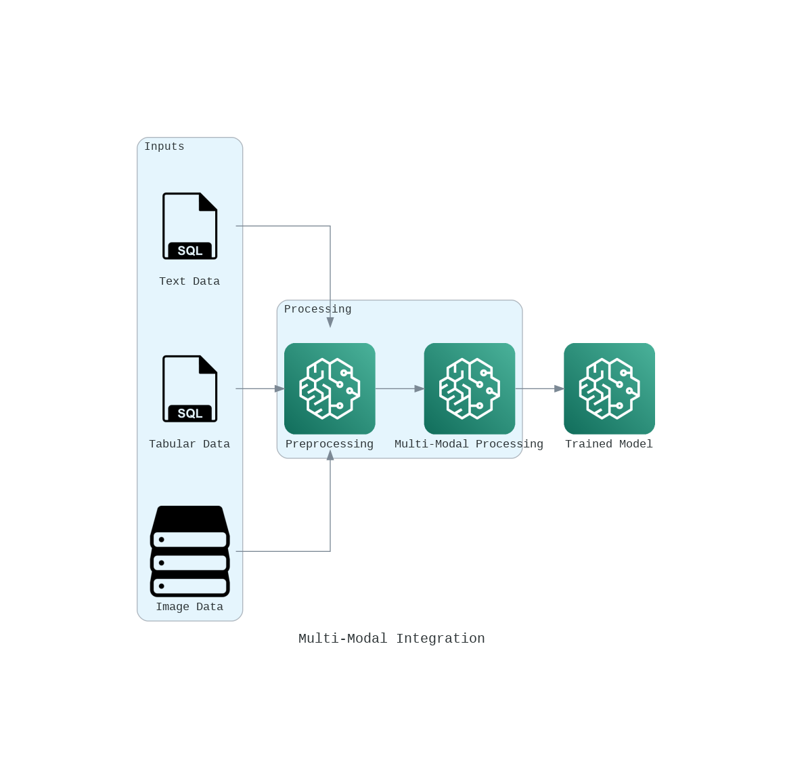

# ApexAI: Advanced AI for Business Course of Action (COA) Optimization

ApexAI is a state-of-the-art AI framework designed to analyze, generate, and optimize business decisions by synthesizing internal and external factors. With capabilities like Reinforcement Learning, Bayesian Networks, Multi-Modal Learning, and Explainable AI, ApexAI serves as an invaluable tool for risk-aware decision-making.

---

## 🚀 Features
- **Hybrid Model Framework**: Combines DCGAN, Bayesian Networks, Gaussian Smoothing, and Ensemble Learning for robust scenario generation and analysis.
- **Reinforcement Learning (RL)**: Uses RLHF and Deep Q-Learning for optimal decision-making.
- **Multi-Modal Data Processing**: Seamlessly integrates text, tabular, and image data.
- **Federated Learning**: Ensures secure and distributed data processing across stakeholders.
- **Explainable AI (XAI)**: Transparency through SHAP, LIME, and SageMaker Clarify integrations.
- **Scalable Architecture**: Built with AWS tools such as S3, SageMaker, Bedrock, OpenSearch, and EKS for cloud-based scalability.
- **Synthetic Data Generation**: Utilizes DCGAN/CTGAN for generating realistic yet synthetic business scenarios.
- **Data Lakehouse**: Centralized data storage and querying using S3 and Athena.

---

## 📁 Project Structure

ai-project/
├── .github/
│   ├── workflows/
│   │   └── ci-cd.yml                        # Continuous Integration and Deployment workflows
│   └── ISSUE_TEMPLATE.md                    # Issue templates for contributors
├── .dockerignore                            # Docker ignore file
├── .gitignore                               # Git ignore file
├── README.md                                # Project overview and documentation
├── LICENSE                                  # License file
├── pyproject.toml                           # Project configuration for Python (e.g., Poetry)
├── requirements.txt                         # Python dependencies
├── docker-compose.yml                       # Multi-service Docker configuration
├── terraform/                               # Infrastructure-as-Code
│   ├── main.tf                              # Main Terraform configuration
│   ├── variables.tf                         # Variable definitions
│   ├── outputs.tf                           # Outputs from the infrastructure setup
│   └── modules/
│       ├── eks/                             # EKS Cluster setup
│       ├── s3/                              # S3 setup for data lakehouse
│       └── vpc/                             # VPC and networking setup
├── scripts/                                 # Utility scripts
│   ├── data_ingestion.py                    # Script for data ingestion pipeline
│   ├── deploy_model.py                      # Script for deploying models
│   └── monitor_jobs.py                      # Monitor running jobs and pipelines
├── notebooks/                               # Jupyter Notebooks for experimentation
│   ├── eda.ipynb                            # Exploratory Data Analysis
│   ├── federated_learning.ipynb             # Federated learning experiments
│   ├── dcgan_training.ipynb                 # Synthetic data generation with DCGAN
│   └── rl_training.ipynb                    # Reinforcement learning training
├── src/                                     # Main source code
│   ├── __init__.py
│   ├── app.py                               # FastAPI entry point
│   ├── config/                              # Configuration files
│   │   ├── settings.py                      # General settings
│   │   └── aws.py                           # AWS-specific configurations
│   ├── data_pipeline/                       # Data collection pipeline
│   │   ├── __init__.py
│   │   ├── collect.py                       # Collect data from APIs and IoT
│   │   ├── preprocess.py                    # Preprocess data with Gaussian smoothing
│   │   ├── synthesize.py                    # Synthetic data creation with DCGAN/CTGAN
│   │   └── lakehouse.py                     # Store data in S3 and query with Athena
│   ├── models/                              # Machine learning models
│   │   ├── __init__.py
│   │   ├── dcgan.py                         # DCGAN implementation
│   │   ├── bayesian_network.py              # Bayesian Network model
│   │   ├── rl_agent.py                      # RLHF + Deep Q-Learning agent
│   │   ├── multi_modal.py                   # Multi-modal training (text, tabular, image)
│   │   └── ensemble_analysis.py             # Scenario analysis ensemble
│   ├── inference/                           # Inference and APIs
│   │   ├── __init__.py
│   │   ├── api.py                           # APIs for model inference
│   │   └── explainability.py                # Explainable AI integrations (SHAP, LIME)
│   ├── federated_learning/                  # Federated learning system
│   │   ├── __init__.py
│   │   ├── server.py                        # Federated server setup
│   │   └── client.py                        # Federated client setup
│   ├── rl_pipeline/                         # Reinforcement Learning Pipeline
│   │   ├── __init__.py
│   │   ├── env.py                           # RL environment definitions
│   │   ├── training.py                      # RL training loop
│   │   └── evaluation.py                    # RL evaluation pipeline
│   └── xai/                                 # Explainable AI module
│       ├── __init__.py
│       ├── shap.py                          # SHAP integration
│       ├── lime.py                          # LIME integration
│       └── clarify.py                       # AWS SageMaker Clarify integration
├── tests/                                   # Unit and integration tests
│   ├── __init__.py
│   ├── test_data_pipeline.py                # Tests for data pipeline
│   ├── test_models.py                       # Tests for models
│   ├── test_inference.py                    # Tests for inference APIs
│   └── test_rl_pipeline.py                  # Tests for RL pipeline
└── docs/                                    # Documentation
    ├── api_reference/                       # API Reference
    │   ├── index.md
    │   └── endpoints.md
    ├── architecture.md                      # System architecture overview
    ├── models.md                            # Detailed model documentation
    ├── deployment.md                        # Deployment guides
    └── tutorials/                           # Tutorials and walkthroughs
        ├── federated_learning.md
        └── synthetic_data.md

🌐 Deployment
ApexAI leverages a scalable cloud-based infrastructure using AWS:

  1. Data Pipeline: S3, Athena, OpenSearch.
  2. Model Training: SageMaker, Bedrock.
  3. Inference: FastAPI served via EKS.

  Diagrams & Visuals
1. System Architecture
A high-level diagram illustrating the flow of data through ApexAI:

2. Model Training Pipeline
A flowchart showing the steps for data ingestion, preprocessing, synthetic data generation, and decision optimization:

3. Reinforcement Learning Flow
State-Action-Reward diagram explaining how RLHF/Deep Q-Learning optimizes decisions:

4. Explainability Workflow
Diagram illustrating SHAP/LIME integration and how model decisions are visualized:

5. Federated Learning Topology
Visualization of the central server managing global models and distributed clients updating local models:

6. Cloud Infrastructure
AWS services diagram showing EKS for orchestration, SageMaker for model training, S3 for storage, Bedrock for LLM integration, and OpenSearch for querying:

7. Multi-Modal Integration
Diagram showcasing how text, tabular, and image data are processed and combined for training:

🛠️ Setup

1. Clone the repository:
git clone https://github.com/your_username/apexai-coa.git
cd apexai-coa

2. Install dependencies:
pip install -r requirements.txt

3. Configure AWS:
Add your AWS credentials in ~/.aws/credentials.
Update Terraform variables in terraform/variables.tf.

4. Deploy infrastructure:
cd terraform
terraform init
terraform apply

5. Start development server:
docker-compose up --build

📚 Documentation
API Reference: Detailed API documentation.
Architecture Overview: In-depth system architecture.
Tutorials: Step-by-step guides.

🛡️ License
This project is licensed under the MIT License.

🤝 Contributing
We welcome contributions! Check out our CONTRIBUTING.md for guidelines.

✨ Acknowledgements
Inspired by cutting-edge frameworks like TensorFlow, PyTorch, and AWS SageMaker. Special thanks to the open-source community for driving innovation.

